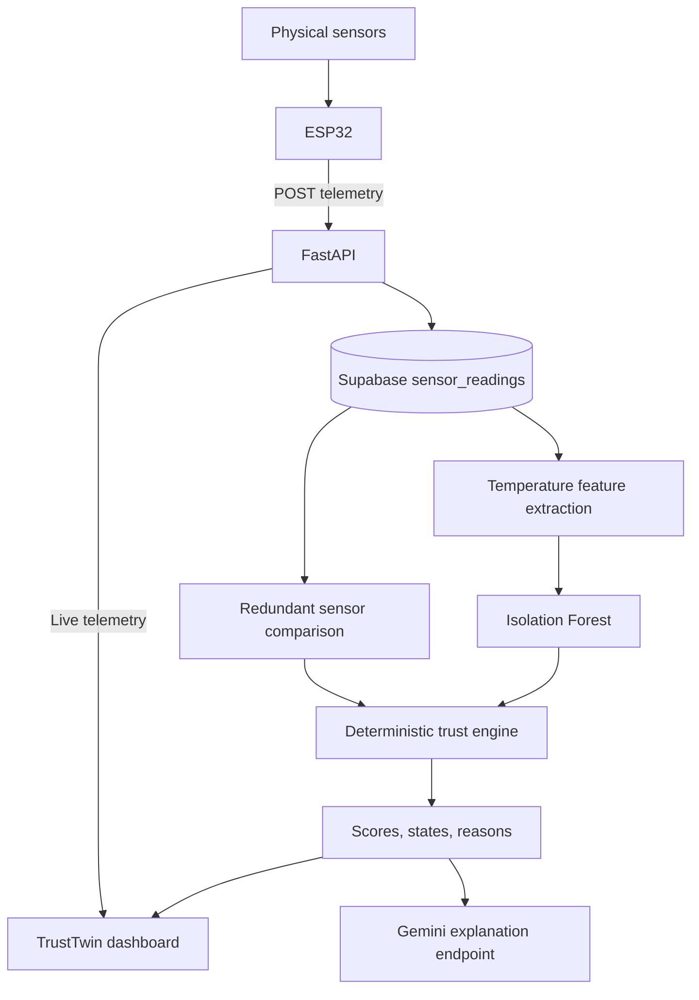

# PulseTrust_

> **Trust Before Action.**

PulseTrust_ is an industrial sensor-trust and machine-monitoring prototype. It combines ESP32 telemetry, Supabase history, Isolation Forest anomaly detection, redundant sensor comparison, and deterministic trust scoring to help distinguish unreliable measurements from real changes in a machine's operating conditions.

**An abnormal measurement does not necessarily mean the sensor is faulty.** Two sensors reporting the same unusual temperature may be accurately observing a real process event. PulseTrust evaluates measurement trust separately from process health.

## Contents

- [Architecture](#architecture)
- [Repository layout](#repository-layout)
- [Local setup](#local-setup)
- [Dashboard](#dashboard)
- [Hardware and telemetry](#hardware-and-telemetry)
- [API reference](#api-reference)
- [Trust engine](#trust-engine)
- [Simulation scenarios](#simulation-scenarios)
- [AWS App Runner deployment](#aws-app-runner-deployment)
- [Checks and tests](#checks-and-tests)
- [Troubleshooting](#troubleshooting)
- [Prototype scope](#prototype-scope)

## Architecture



The backend application is `app.main:app`. The dashboard uses vanilla HTML, CSS, JavaScript, and SVG; it has no Node.js build step. Gemini explains evidence through a separate API endpoint and does not calculate or override trust scores.

Experimental component lookup and datasheet modules use Mouser, Nexar, Gemini, and PDF extraction. They are separate from the live temperature-trust pipeline and are not exposed as dedicated routes in `app.main`.

## Repository layout

```text
PulseTrust_/
|-- backend/
|   |-- app/
|   |   |-- main.py                 # API routes, CORS, optional dashboard serving
|   |   |-- config.py               # Environment-backed settings
|   |   |-- database.py             # Supabase access
|   |   |-- models.py               # Telemetry request schema
|   |   `-- trust/                  # Features, inference, scoring, integrations
|   |-- models/
|   |   `-- temperature_isolation_forest.joblib
|   |-- tests/test_deployment.py
|   |-- .env.example
|   |-- requirements.txt
|   |-- start.py                    # PORT-aware server launcher
|   |-- apprunner.yaml
|   `-- DEPLOYMENT.md
|-- frontend/
|   |-- index.html
|   |-- styles.css
|   |-- dashboard.css
|   `-- script.js
|-- Firmware/ESP32-firmware.ino
|-- supabase_schema.sql
|-- supabase_migration_add_hall_raw.sql
`-- LICENSE
```

## Local setup

Run these commands from the repository root unless instructed otherwise.

### 1. Create a Python environment

Python 3.11 is the configured App Runner target. Local deployment checks have also passed on Python 3.14. Use an interpreter with compatible packages for your operating system; target-runtime caveats are listed under deployment.

```sh
cd backend
python -m venv .venv
```

Activate it in PowerShell:

```powershell
.\.venv\Scripts\Activate.ps1
```

Or on macOS/Linux:

```sh
source .venv/bin/activate
```

Install the dependencies:

```sh
python -m pip install -r requirements.txt
```

### 2. Configure runtime environment variables

Create `backend/.env`. You can copy `backend/.env.example`, but that template currently contains only the Supabase entries: **add `GEMINI_API_KEY` yourself**.

```dotenv
SUPABASE_URL=https://your-project.supabase.co
SUPABASE_KEY=your_backend_supabase_key
GEMINI_API_KEY=your_gemini_api_key
```

These are placeholders, not working credentials.

| Variable | Purpose | Required when |
|---|---|---|
| `SUPABASE_URL` | Supabase project URL | Reading or writing live telemetry |
| `SUPABASE_KEY` | Backend database credential | Reading or writing live telemetry |
| `GEMINI_API_KEY` | Gemini client credential | Starting the current app; client initialization occurs at import |
| `MOUSER_API_KEY` | Component lookup | Using the Mouser integration |
| `NEXAR_CLIENT_ID` | Nexar client identifier | Using the Nexar integration |
| `NEXAR_CLIENT_SECRET` | Nexar client secret | Using the Nexar integration |
| `PORT` | Server listening port | Optional; `start.py` defaults to `8080` |

Keep credentials on the backend. `.env` is ignored by Git; never copy backend credentials into frontend code, firmware, or deployment YAML. Run local commands from `backend` so the current settings loader finds its `.env` file.

Gemini request failures are handled by the explanation endpoint, allowing deterministic trust results to remain available. A missing Gemini key can still prevent application startup because the client is initialized when the module is imported.

### 3. Set up Supabase

For a new database, run [supabase_schema.sql](supabase_schema.sql) in the Supabase SQL editor. It creates `sensor_readings` and an index on device ID and recording time.

For an existing installation that lacks `hall_raw`, run [supabase_migration_add_hall_raw.sql](supabase_migration_add_hall_raw.sql) instead of recreating the table. Ensure the backend credential has the required read/write access.

The API supplies `recorded_at` in UTC during ingestion. The schema also maintains `id` and `created_at`. There is no automatic database migration at server startup.

### 4. Start the server

From `backend`, with the virtual environment active:

```sh
python start.py
```

This starts `app.main:app` on `0.0.0.0`, using `PORT` or defaulting to `8080`.

| Local URL | Purpose |
|---|---|
| http://127.0.0.1:8080/dashboard/ | TrustTwin dashboard, when the frontend folder exists |
| http://127.0.0.1:8080/docs | Interactive Swagger API documentation |
| http://127.0.0.1:8080/redoc | ReDoc API reference |
| http://127.0.0.1:8080/health | Service health and database configuration presence |
| http://127.0.0.1:8080/ | API metadata |

For development with automatic reload:

```sh
python -m uvicorn app.main:app --host 0.0.0.0 --port 8080 --reload
```

The direct Uvicorn command uses the explicit port; `start.py` is the entry point that reads `PORT`. In PowerShell, set a different launcher port with `$env:PORT = "9090"` before running `python start.py`.

## Dashboard

The recommended local setup is the backend-served `/dashboard/` URL. It automatically uses the same origin for API requests, including a custom backend port.

The dashboard provides sidebar navigation, a trust-score overview, an animated fan digital twin, temperature/RPM/electrical/vibration panels, per-sensor trust, evidence panels, charts, a trust-state timeline, and technical diagnostics. Telemetry cards open expanded charts.

Live polling runs every five seconds and retries after connection failures. If trust analysis is unavailable, raw telemetry can still be displayed. Charts accumulate up to 200 readings during the browser session; they do not currently preload the database's historical readings.

Some panels await backend fields that are not currently returned, including the detailed score-breakdown ledger and temporal summary. The Gemini explanation endpoint is not polled by the dashboard. The API's `agreement` field is an object, while the current summary badges expect a boolean, so those badges may show a dash even when agreement evidence is present. These are frontend integration gaps, not missing database readings.

### Separate frontend development server

The standalone frontend currently connects to **port 8000 on its own hostname**. To use that mode, start the backend from `backend`:

```sh
python -m uvicorn app.main:app --host 0.0.0.0 --port 8000 --reload
```

In another terminal, from the repository root:

```sh
cd frontend
python -m http.server 5500
```

Open http://127.0.0.1:5500. Avoid opening `index.html` directly through a `file://` URL.

A separately deployed Amplify frontend still needs its API base URL updated to the App Runner service URL. That frontend deployment wiring has not been implemented.

## Hardware and telemetry

The prototype hardware includes an ESP32 DevKit, two DS18B20 temperature sensors, an MPU6050-family IMU, a 44E Hall-effect sensor, an INA219 electrical monitor, a 5V DC fan, an OLED display, LEDs, and a buzzer. Firmware is in [Firmware/ESP32-firmware.ino](Firmware/ESP32-firmware.ino).

All fields below are required by the current telemetry request schema:

```json
{
  "device_id": "pulsetrust-plant-01",
  "temp_1": 28.5,
  "temp_2": 28.75,
  "rpm": 1500.0,
  "hall_raw": 320,
  "vibration": 9.61,
  "voltage": 4.85,
  "current": 0.143,
  "power": 0.694,
  "fan": true
}
```

Temperatures are in degrees Celsius; electrical values use volts, amperes, and watts. The dashboard labels vibration in m/s squared, but the IMU value can include gravity and should not automatically be interpreted as a calibrated vibration-severity measurement.

To ingest real readings, send JSON to `POST /api/telemetry`, or use **Try it out** in `/docs`. A successful write returns HTTP 201 with `success`, `message`, and `reading`. Trust analysis needs at least five temperature readings per sensor.

### ESP32 over LAN

With the default launcher, point the firmware at:

```text
http://<backend-machine-LAN-IP>:8080/api/telemetry
```

Use `ipconfig` on Windows to find the machine's LAN address. The ESP32 and backend must be reachable on the network, and the firewall must allow the listening port. `127.0.0.1` on the ESP32 refers to the ESP32 itself. If running the standalone development setup on port 8000, use that port in the firmware URL too.

## API reference

| Method | Path | Behavior |
|---|---|---|
| GET | `/` | Project metadata and API status |
| GET | `/health` | Health response and `database_configured` flag; no database connectivity probe |
| POST | `/api/telemetry` | Validate and store a reading; HTTP 201 on success |
| GET | `/api/telemetry` | Recent readings, newest first; optional `device_id`, `limit` defaults to 50 and has a maximum of 500 |
| GET | `/api/telemetry/latest` | Latest reading; optional `device_id`; HTTP 404 when empty |
| GET | `/api/trust/latest` | Temperature trust analysis; optional `device_id` |
| GET | `/api/trust/explain` | Trust result plus Gemini interpretation; optional `device_id` |
| GET | `/api/trust/demo/{scenario}` | Backend-generated simulation; no database history required |

Trust endpoints retrieve up to 100 recent rows and require at least five valid temperatures for each sensor. They return HTTP 404 when there is no telemetry and HTTP 400 when history is insufficient. Use `device_id` when monitoring multiple devices: unfiltered trust queries can combine rows from different devices. The dashboard filters its trust request to match the latest telemetry's device.

Live trust responses include `mode: "LIVE"`, `device_id`, `trust_score`, `state`, `sensor_1`, `sensor_2`, `agreement`, `corroborated_event`, and `reasons`. The `agreement` object contains `difference`, `agreement_score`, and `agrees`.

The explanation endpoint returns `trust` and `ai_reasoning` objects. The latter contains a summary, sensor assessment, process assessment, and recommended action when available.

## Trust engine

1. Extract six temperature-history features: normalized value, rate of change, rolling mean, rolling standard deviation, deviation from baseline, and stuck score.
2. Load the committed Isolation Forest model and evaluate each temperature sensor independently.
3. Compare the latest temperatures. The default agreement tolerance is 1 degree Celsius; agreement confidence declines beyond that tolerance.
4. Start each sensor at 100, subtract 20 for anomalous behavior, and apply disagreement penalties using the behavioral evidence to assign responsibility where possible.
5. If both sensors are anomalous but agree, restore 15 points per sensor and flag a corroborated event.
6. Clamp each sensor score to 0-100 and average them to obtain overall trust.

| Overall score | State |
|---|---|
| 80-100 | `TRUSTED` |
| 50 to less than 80 | `DEGRADED` |
| Below 50 | `UNTRUSTED` |

These are heuristic evidence scores, not calibrated probabilities. High trust means the measurements may be credible; it does not mean the physical process is safe.

The model is stored at `backend/models/temperature_isolation_forest.joblib`. Loading and training-output paths are resolved relative to backend source, independent of the process working directory. The committed model uses scikit-learn 1.9.1, which is pinned in the runtime requirements. The synthetic-baseline training utilities are provided for development; deployment does not retrain or replace the model.

## Simulation scenarios

The backend exposes three deterministic scenario inputs:

| Scenario | Endpoint | Intended demonstration |
|---|---|---|
| Normal | `/api/trust/demo/normal` | Similar readings from both sensors |
| Sensor failure | `/api/trust/demo/sensor-failure` | One temperature jumps while the other remains near baseline |
| Real event | `/api/trust/demo/real-event` | Both temperatures rise together |

Open an endpoint in the browser or invoke it through `/docs`. Results use the existing model and scoring logic and include `mode: "SIMULATION"` and `scenario`. They are not stored as live sensor telemetry. The normal startup requirements, including Gemini client initialization, still apply.

The frontend retains scenario controls for its internal demo mode, but currently starts in live mode and does not automatically switch to simulation when disconnected. Use the API endpoints to exercise scenarios without hardware.

## AWS App Runner deployment

The backend has source-deployment configuration in [backend/apprunner.yaml](backend/apprunner.yaml). Full operational notes are in [backend/DEPLOYMENT.md](backend/DEPLOYMENT.md).

| App Runner setting | Exact value |
|---|---|
| Repository source directory | `/backend` |
| Configuration source | Use a configuration file |
| Configuration file | `apprunner.yaml` in the source directory |
| Runtime | Python 3.11 (`python311`) |
| Build command | `python3 -m compileall -q app start.py` |
| Pre-run command 1 | `pip3 install --no-cache-dir -r requirements.txt` |
| Pre-run command 2 | `pip3 check` |
| Start command | `python3 start.py` |
| Application | `app.main:app` |
| Bind address | `0.0.0.0` |
| Network port | `8080`, exported as `PORT` |
| Health check | HTTP `/health`, configured in the service console |

The pre-run dependency installation follows [AWS's Python 3.11 runtime instructions](https://docs.aws.amazon.com/apprunner/latest/dg/service-source-code-python.html): global packages installed only during the build stage are not preserved by the revised build process.

Configure runtime secrets through App Runner's Secrets Manager or SSM references and give the service instance role access to them. Set `SUPABASE_URL`, `SUPABASE_KEY`, and `GEMINI_API_KEY`; add component-integration credentials when needed. The compile-only build does not need secrets.

Keep the committed model in the deployment source. The API can start without the sibling `frontend` directory; it serves `/dashboard` only when that directory exists. Supabase and Gemini remain external services in the existing architecture.

CORS currently allows wildcard origins and GET/POST requests with credentials disabled for the initial hackathon deployment. CORS is not authentication: the current API has no authentication layer. Review access controls before exposing real telemetry or ingestion beyond the intended demo audience.

### Deployment verification status

Local tests, compilation, dependency consistency, YAML parsing, and a Linux CPython 3.11 dependency-resolution dry run have passed. **An AWS deployment and actual Python 3.11 model inference have not been verified.**

The model's scikit-learn 1.9.1 Linux wheels require glibc 2.27 or newer. The successful dependency dry run included manylinux 2.28 wheels; compatibility with the selected managed runtime image remains to be checked. An older image may attempt a source build. Do not downgrade scikit-learn or retrain the model solely to bypass deployment errors without validating compatibility and output behavior.

The future Amplify frontend also needs explicit API URL configuration; CORS preparation alone does not connect it to App Runner.

## Checks and tests

From `backend`, with the virtual environment active:

```sh
python -m unittest discover -s tests -v
python -m pip check
python -m compileall -q app start.py
```

The five deployment tests cover the default/custom port, model inference from another working directory, metadata/health/simulation endpoints, Amplify-style CORS preflights, and startup without the frontend directory. They mock Gemini client construction and do not require live database access or real credentials.

For live integration verification after configuring services, check `/api/telemetry/latest`, then `/api/trust/latest?device_id=<your-device-id>`. Test `/api/trust/explain` separately if you want to verify Gemini requests. `/health` alone does not validate either external service.

## Troubleshooting

| Symptom | What to check |
|---|---|
| Gemini credential error during startup | Add `GEMINI_API_KEY`; run from `backend` for local `.env` loading. |
| Database configured is true, but requests fail | The health flag only checks that settings exist. Verify Supabase connectivity, credentials, table schema, and permissions. |
| No readings / HTTP 404 | Send telemetry to the correct backend and check the device filter. |
| Trust endpoint returns HTTP 400 | Supply at least five valid temperature readings per sensor for the selected device. |
| Database ingestion fails after an older installation | Apply the `hall_raw` migration and verify all required fields. |
| Dashboard says disconnected | Confirm the server is running and check the API URL. Same-origin `/dashboard/` follows the backend port; standalone hosting currently targets port 8000. |
| Trust panels show unavailable while telemetry works | Check `/api/trust/latest` directly; some optional dashboard fields are not emitted by the current backend. |
| Agreement badges show a dash | The frontend currently expects a boolean while the API returns an agreement object. Inspect `agreement.agrees` in the raw response. |
| Model cannot load | Verify the committed model exists and the installed scikit-learn version matches requirements. Do not regenerate it as an automatic repair. |
| App Runner cannot install scientific dependencies | Check Python version and Linux wheel/glibc compatibility; see the deployment verification notes. |
| ESP32 cannot reach the backend | Use the machine's LAN IP, the actual server port, and an appropriate firewall rule. |

## Prototype scope

PulseTrust_ is a hackathon prototype, not a certified industrial safety system. Temperature sensors are the current focus of learned trust inference; other measurements are collected and visualized. The synthetic training baseline, heuristic scores, incomplete dashboard field mappings, and experimental component/datasheet tools are development constraints.

API routes report telemetry and trust evidence; they do not provide a general-purpose actuator command API. Future work includes broader sensor coverage, validated training data, complete dashboard/API mappings, deployment verification, and access controls for wider use.

## License

This project is distributed under the [MIT License](LICENSE).
